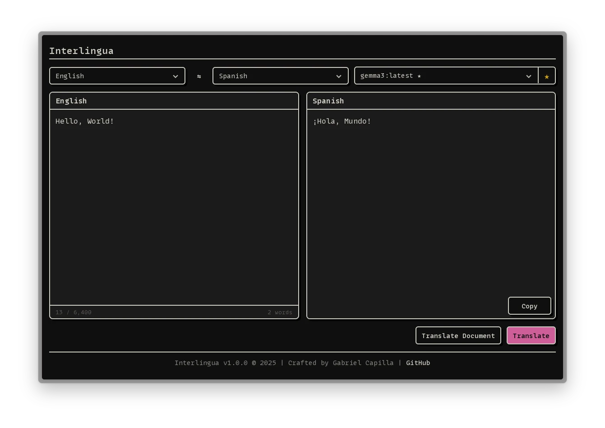

# Interlingua



A locally-run translation application powered by [Ollama](https://ollama.com/) or [llama.cpp](https://github.com/ggml-org/llama.cpp). Private, fast, and accurate translations directly on your machine.

## Prerequisites

- [Bun](https://bun.sh/) (or npm)
- Ollama or llama.cpp installed and running
- A compatible local model

## Installation

```sh
git clone https://github.com/gabrielcapilla/interlingua.git
cd interlingua
bun install
```

## Running

```sh
bun run build
bun run preview
```

Interlingua discovers both providers automatically:

- Ollama: `http://localhost:11434/api`
- llama.cpp: `http://localhost:4256/v1`

Start Ollama with `ollama serve`, or start llama.cpp with an OpenAI-compatible server, for example:

```sh
llama-server --model /path/to/model.gguf --host 0.0.0.0 --port 4256
```

## Long documents

There is no fixed character limit in the editor. Long input is divided into ordered model requests using a conservative source-token budget, keeping short documents' paragraphs atomic and packing complete paragraphs for larger documents. It falls back to sentence, clause, word, and finally grapheme boundaries only when necessary. Separators are reassembled locally so formatting is not delegated to chunk boundaries.

The default budget is 1,600 estimated source tokens per translation request, with a 600-token representative sample for language detection. Larger drafts require an explicit Translate action instead of automatic translation and show chunk progress with cancellation. A practical 512-chunk safety guard protects the browser and local inference server; it is an operational safeguard, not a quality-driven character limit. Oversized protected URLs, identifiers, or code blocks are reported rather than silently split. Provider streams are rendered incrementally in the output frame, with an indeterminate progress bar for a single request and chunk-completion progress for longer drafts.

## Checks and evaluation

Run the deterministic repository checks without a model server:

```sh
bun run check
```

For coverage details:

```sh
bun run test:coverage
bun run format:check
bun run measure:runtime
```

The local TranslateGemma evaluation is opt-in because it requires a running provider. Set the model path or provider reference before running it:

```sh
INTERLINGUA_EVAL_PROVIDER=llamacpp \
INTERLINGUA_EVAL_MODEL=/path/to/translategemma-4b-it.Q4_K_M.gguf \
bun run benchmark:local
```

The benchmark reports detection accuracy, unknown results, translation fidelity checks, response-contract violations, format leakage, prompt size, cache hits, and mean/p50/p95 latency. Add `--strict --compare` to enforce thresholds and compare the current prompt with the legacy variant. Its fixtures are regression signals rather than a general translation-quality score.

## Recommended Models for Translation

[TranslateGemma](https://blog.google/innovation-and-ai/technology/developers-tools/translategemma/) is our recommended model—a new open translation model built on Gemma 3 that supports 55 languages.

**Installation:**

```sh
ollama pull translategemma
```

**Available variants:**

- `translategemma:4b` (~3.3GB) - Fast and efficient for everyday translations
- `translategemma:12b` (~8.1GB) - Best balance of speed and quality
- `translategemma:27b` (~17GB) - Highest quality for complex texts

Provider runtimes may expose larger context windows, but Interlingua keeps each translation request within a conservative TranslateGemma budget. See the [TranslateGemma model card](https://huggingface.co/google/translategemma-4b-it) for the model's documented context guidance.

## License

Interlingua is released under the [MIT License](LICENSE).
